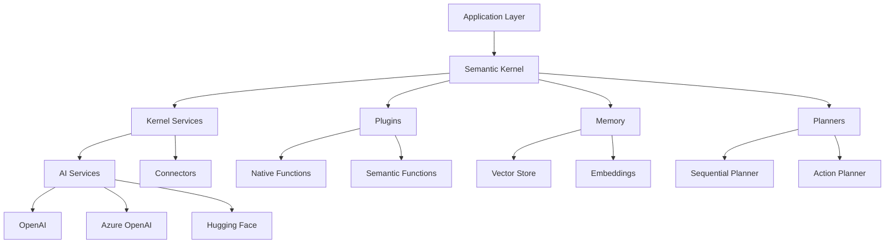

# Microsoft Semantic Kernel

## 🧠 Overview

Microsoft Semantic Kernel (SK) is an open-source SDK that lets you easily combine AI services like OpenAI, Azure OpenAI, and Hugging Face with conventional programming languages like C#, Python, and Java. It serves as a lightweight, enterprise-ready orchestration layer that enables developers to create AI agents and integrate large language models (LLMs) into their applications.

## 📋 Table of Contents

- [Key Features](#key-features)
- [Architecture](#architecture)
- [Getting Started](#getting-started)
- [Core Concepts](#core-concepts)
- [Plugins & Functions](#plugins--functions)
- [Memory & Embeddings](#memory--embeddings)
- [Planners](#planners)
- [Code Examples](#code-examples)
- [Best Practices](#best-practices)
- [Integration Scenarios](#integration-scenarios)
- [Troubleshooting](#troubleshooting)

## 🚀 Key Features

### **Multi-Language Support**
- **C#**: First-class support with .NET integration
- **Python**: Full-featured implementation
- **Java**: Enterprise-ready SDK
- **TypeScript/JavaScript**: Web and Node.js support

### **AI Service Integration**
| Service | Provider | Capabilities |
|---------|----------|-------------|
| GPT-4/GPT-3.5 | OpenAI | Text generation, completion |
| Azure OpenAI | Microsoft | Enterprise-grade AI services |
| Claude | Anthropic | Advanced reasoning |
| Llama 2 | Meta | Open-source models |
| Hugging Face | Community | Diverse model ecosystem |

### **Enterprise Features**
- 🔐 **Security**: Built-in authentication and authorization
- 📊 **Observability**: Logging, metrics, and tracing
- 🏗️ **Scalability**: Async/await patterns and performance optimization
- 🔧 **Extensibility**: Plugin architecture for custom functionality

## 🏗️ Architecture



## 🎯 Getting Started

### **Installation**

#### C# (.NET)
```bash
dotnet add package Microsoft.SemanticKernel
dotnet add package Microsoft.SemanticKernel.Plugins.Core
```

#### Python
```bash
pip install semantic-kernel
pip install semantic-kernel[azure]
```

#### TypeScript/JavaScript
```bash
npm install @microsoft/semantic-kernel
```

### **Basic Setup**

#### C# Example
```csharp
using Microsoft.SemanticKernel;
using Microsoft.SemanticKernel.AI.OpenAI;

// Create kernel instance
var kernel = Kernel.CreateBuilder()
    .AddAzureOpenAIChatCompletion(
        deploymentName: "gpt-35-turbo",
        endpoint: "https://your-resource.openai.azure.com/",
        apiKey: "your-api-key")
    .Build();

// Simple prompt execution
var prompt = "Translate 'Hello World' to French";
var result = await kernel.InvokePromptAsync(prompt);
Console.WriteLine(result);
```

#### Python Example
```python
import semantic_kernel as sk
from semantic_kernel.connectors.ai.open_ai import AzureChatCompletion

# Initialize kernel
kernel = sk.Kernel()

# Add AI service
azure_chat_service = AzureChatCompletion(
    deployment_name="gpt-35-turbo",
    endpoint="https://your-resource.openai.azure.com/",
    api_key="your-api-key"
)
kernel.add_chat_service("azure_chat", azure_chat_service)

# Execute prompt
async def main():
    prompt = "Explain quantum computing in simple terms"
    result = await kernel.invoke_prompt_async(prompt)
    print(result)

import asyncio
asyncio.run(main())
```

## 🧩 Core Concepts

### **1. Kernel**
The central orchestration engine that manages AI services, plugins, and memory.

```csharp
var kernel = Kernel.CreateBuilder()
    .AddAzureOpenAIChatCompletion(deploymentName, endpoint, apiKey)
    .AddAzureOpenAITextEmbeddingGeneration(embeddingDeployment, endpoint, apiKey)
    .Build();
```

### **2. Functions**
Reusable pieces of functionality that can be combined to solve complex problems.

#### Native Functions (C#)
```csharp
public class MathPlugin
{
    [KernelFunction]
    [Description("Add two numbers")]
    public double Add(
        [Description("First number")] double number1,
        [Description("Second number")] double number2)
    {
        return number1 + number2;
    }
    
    [KernelFunction]
    [Description("Calculate compound interest")]
    public double CompoundInterest(
        [Description("Principal amount")] double principal,
        [Description("Annual interest rate")] double rate,
        [Description("Number of years")] int years)
    {
        return principal * Math.Pow(1 + rate, years);
    }
}
```

#### Semantic Functions
```csharp
var summarizeFunction = kernel.CreateFunctionFromPrompt(
    promptTemplate: @"
    Summarize the following text in 2-3 sentences:
    
    {{$input}}
    
    Summary:",
    functionName: "Summarize",
    description: "Summarize text content"
);

var result = await kernel.InvokeAsync(summarizeFunction, new() { ["input"] = longText });
```

### **3. Plugins**
Collections of related functions that can be imported and used together.

```csharp
// Import built-in plugins
kernel.ImportPluginFromType<TimePlugin>("time");
kernel.ImportPluginFromType<MathPlugin>("math");

// Import custom plugin
kernel.ImportPluginFromObject(new EmailPlugin(emailService), "email");

// Use plugin functions
var currentTime = await kernel.InvokeAsync("time", "Now");
var sum = await kernel.InvokeAsync("math", "Add", new() { 
    ["number1"] = "10", 
    ["number2"] = "20" 
});
```

## 🧠 Memory & Embeddings

### **Vector Memory Store**
```csharp
using Microsoft.SemanticKernel.Memory;

// Configure memory store
var memoryBuilder = new MemoryBuilder();
memoryBuilder.WithAzureOpenAITextEmbeddingGeneration(
    deploymentName: "text-embedding-ada-002",
    endpoint: endpoint,
    apiKey: apiKey);
memoryBuilder.WithMemoryStore(new VolatileMemoryStore());

var memory = memoryBuilder.Build();

// Store information
await memory.SaveInformationAsync(
    collection: "products",
    text: "The iPhone 15 Pro features a titanium design and A17 Pro chip",
    id: "iphone15pro",
    description: "iPhone 15 Pro specifications"
);

// Search memory
var searchResults = memory.SearchAsync(
    collection: "products",
    query: "What are the features of the latest iPhone?",
    limit: 5);

await foreach (var result in searchResults)
{
    Console.WriteLine($"Relevance: {result.Relevance:F2}");
    Console.WriteLine($"Text: {result.Metadata.Text}");
}
```

### **RAG (Retrieval-Augmented Generation)**
```python
import semantic_kernel as sk
from semantic_kernel.memory.volatile_memory_store import VolatileMemoryStore

# Setup kernel with memory
kernel = sk.Kernel()
kernel.add_chat_service("azure_chat", azure_chat_service)
kernel.add_text_embedding_generation_service(
    "azure_embedding", azure_embedding_service
)

# Register memory store
kernel.register_memory_store(VolatileMemoryStore())

# Save documents to memory
await kernel.memory.save_information_async(
    collection="documents",
    text="Python is a high-level programming language known for its simplicity",
    id="python_intro",
    description="Introduction to Python programming"
)

# RAG-enabled function
rag_function = kernel.create_semantic_function(
    prompt_template="""
    Use the following context to answer the question:
    
    Context: {{recall $query}}
    
    Question: {{$query}}
    
    Answer:""",
    function_name="RAGAnswer"
)

result = await kernel.run_async(
    rag_function,
    input_vars={"query": "What is Python?"}
)
```

## 🎯 Planners

### **Sequential Planner**
Automatically creates and executes multi-step plans.

```csharp
using Microsoft.SemanticKernel.Planning;

var planner = new SequentialPlanner(kernel);

var plan = await planner.CreatePlanAsync(
    "Send an email to john@example.com with the weather forecast for Seattle");

Console.WriteLine("Plan steps:");
foreach (var step in plan.Steps)
{
    Console.WriteLine($"- {step.Description}");
}

// Execute the plan
var result = await kernel.RunAsync(plan);
Console.WriteLine($"Result: {result}");
```

### **Function Calling Planner**
```python
from semantic_kernel.planning import FunctionCallingStepwisePlanner

# Create planner
planner = FunctionCallingStepwisePlanner(
    kernel, 
    max_iterations=10,
    max_tokens=4000
)

# Execute complex task
result = await planner.invoke_async(
    "Find the current temperature in New York and convert it to Celsius"
)

print(f"Final result: {result.final_answer}")
print(f"Steps taken: {len(result.iterations)}")
```

## 💻 Advanced Code Examples

### **Custom AI Agent**
```csharp
public class CustomerServiceAgent
{
    private readonly Kernel _kernel;
    private readonly ISemanticTextMemory _memory;
    
    public CustomerServiceAgent(Kernel kernel, ISemanticTextMemory memory)
    {
        _kernel = kernel;
        _memory = memory;
    }
    
    public async Task<string> HandleCustomerQueryAsync(string query, string customerId)
    {
        // Retrieve customer context from memory
        var customerContext = await _memory.SearchAsync(
            collection: $"customer_{customerId}",
            query: query,
            limit: 3
        ).ToListAsync();
        
        var contextText = string.Join("\n", customerContext.Select(c => c.Metadata.Text));
        
        // Create contextual response
        var responseFunction = _kernel.CreateFunctionFromPrompt(@"
            You are a helpful customer service agent. Use the customer context below to provide a personalized response.
            
            Customer Context:
            {{$context}}
            
            Customer Query: {{$query}}
            
            Response:");
        
        var result = await _kernel.InvokeAsync(responseFunction, new KernelArguments
        {
            ["context"] = contextText,
            ["query"] = query
        });
        
        return result.ToString();
    }
}
```

### **Multi-Modal Processing**
```python
async def process_image_and_text(kernel, image_path: str, text_query: str):
    """Process both image and text inputs using multi-modal AI"""
    
    # Image analysis function
    image_function = kernel.create_semantic_function(
        prompt_template="""
        Analyze this image and describe what you see:
        
        Image: {{$image}}
        
        Description:""",
        function_name="AnalyzeImage"
    )
    
    # Text processing function  
    text_function = kernel.create_semantic_function(
        prompt_template="""
        Based on the image description and user query, provide a comprehensive answer:
        
        Image Description: {{$image_description}}
        User Query: {{$query}}
        
        Answer:""",
        function_name="ProcessQuery"
    )
    
    # Load and encode image
    with open(image_path, "rb") as image_file:
        image_data = base64.b64encode(image_file.read()).decode()
    
    # Analyze image
    image_result = await kernel.run_async(
        image_function,
        input_vars={"image": image_data}
    )
    
    # Process combined input
    final_result = await kernel.run_async(
        text_function,
        input_vars={
            "image_description": str(image_result),
            "query": text_query
        }
    )
    
    return str(final_result)
```

### **Streaming Responses**
```csharp
public async IAsyncEnumerable<string> StreamResponseAsync(string prompt)
{
    var function = _kernel.CreateFunctionFromPrompt(prompt);
    
    await foreach (var chunk in _kernel.InvokeStreamingAsync<string>(function))
    {
        yield return chunk;
    }
}

// Usage
await foreach (var chunk in agent.StreamResponseAsync("Write a story about AI"))
{
    Console.Write(chunk);
    await Task.Delay(50); // Simulate typing effect
}
```

## 📊 Best Practices

### **1. Performance Optimization**
```csharp
// Use dependency injection
services.AddScoped<Kernel>(provider => 
{
    return Kernel.CreateBuilder()
        .AddAzureOpenAIChatCompletion(/* config */)
        .Build();
});

// Implement caching
services.AddMemoryCache();
services.AddScoped<ICachedKernelService, CachedKernelService>();

// Connection pooling
services.Configure<HttpClientFactoryOptions>(options =>
{
    options.HandlerLifetime = TimeSpan.FromMinutes(5);
});
```

### **2. Error Handling**
```csharp
public async Task<string> SafeInvokeAsync(string prompt)
{
    try
    {
        var result = await _kernel.InvokePromptAsync(prompt);
        return result.ToString();
    }
    catch (HttpRequestException ex) when (ex.Message.Contains("429"))
    {
        // Rate limiting - implement exponential backoff
        await Task.Delay(TimeSpan.FromSeconds(Math.Pow(2, retryCount)));
        return await SafeInvokeAsync(prompt);
    }
    catch (ArgumentException ex)
    {
        // Invalid input handling
        _logger.LogWarning("Invalid prompt: {Error}", ex.Message);
        return "I'm sorry, I couldn't process that request.";
    }
}
```

### **3. Security Considerations**
```csharp
// Input validation
public class PromptValidator
{
    private readonly string[] _blockedPatterns = { "ignore previous", "system:", "assistant:" };
    
    public bool IsValidPrompt(string prompt)
    {
        return !_blockedPatterns.Any(pattern => 
            prompt.ToLower().Contains(pattern.ToLower()));
    }
}

// Content filtering
public async Task<string> GetFilteredResponseAsync(string prompt)
{
    var result = await _kernel.InvokePromptAsync(prompt);
    var filteredResult = await _contentFilter.FilterAsync(result.ToString());
    return filteredResult;
}
```

## 🔗 Integration Scenarios

### **1. Web API Integration**
```csharp
[ApiController]
[Route("api/[controller]")]
public class ChatController : ControllerBase
{
    private readonly Kernel _kernel;
    
    public ChatController(Kernel kernel)
    {
        _kernel = kernel;
    }
    
    [HttpPost("completions")]
    public async Task<IActionResult> GetCompletion([FromBody] ChatRequest request)
    {
        var result = await _kernel.InvokePromptAsync(request.Prompt);
        
        return Ok(new ChatResponse
        {
            Message = result.ToString(),
            Timestamp = DateTime.UtcNow
        });
    }
    
    [HttpPost("completions/stream")]
    public async Task<IActionResult> GetStreamingCompletion([FromBody] ChatRequest request)
    {
        Response.ContentType = "text/event-stream";
        
        await foreach (var chunk in _kernel.InvokeStreamingAsync<string>(
            _kernel.CreateFunctionFromPrompt(request.Prompt)))
        {
            await Response.WriteAsync($"data: {chunk}\n\n");
            await Response.Body.FlushAsync();
        }
        
        return new EmptyResult();
    }
}
```

### **2. Background Service**
```csharp
public class DocumentProcessingService : BackgroundService
{
    private readonly Kernel _kernel;
    private readonly IServiceProvider _serviceProvider;
    
    protected override async Task ExecuteAsync(CancellationToken stoppingToken)
    {
        while (!stoppingToken.IsCancellationRequested)
        {
            using var scope = _serviceProvider.CreateScope();
            var documentQueue = scope.ServiceProvider.GetRequiredService<IDocumentQueue>();
            
            var document = await documentQueue.DequeueAsync(stoppingToken);
            if (document != null)
            {
                await ProcessDocumentAsync(document);
            }
            
            await Task.Delay(1000, stoppingToken);
        }
    }
    
    private async Task ProcessDocumentAsync(Document document)
    {
        var summaryFunction = _kernel.CreateFunctionFromPrompt(@"
            Summarize the following document:
            
            {{$content}}
            
            Summary:");
        
        var summary = await _kernel.InvokeAsync(summaryFunction, 
            new KernelArguments { ["content"] = document.Content });
        
        document.Summary = summary.ToString();
        await _documentRepository.UpdateAsync(document);
    }
}
```

## 🛠️ Troubleshooting

### **Common Issues**

#### **1. Rate Limiting**
```csharp
// Implement retry with exponential backoff
public class RateLimitHandler : DelegatingHandler
{
    protected override async Task<HttpResponseMessage> SendAsync(
        HttpRequestMessage request, CancellationToken cancellationToken)
    {
        var response = await base.SendAsync(request, cancellationToken);
        
        if (response.StatusCode == HttpStatusCode.TooManyRequests)
        {
            var retryAfter = response.Headers.RetryAfter?.Delta ?? TimeSpan.FromSeconds(1);
            await Task.Delay(retryAfter, cancellationToken);
            return await SendAsync(request, cancellationToken);
        }
        
        return response;
    }
}
```

#### **2. Memory Management**
```python
# Proper cleanup for long-running applications
import gc
from semantic_kernel.memory import VolatileMemoryStore

class ManagedMemoryStore:
    def __init__(self, max_items: int = 1000):
        self.store = VolatileMemoryStore()
        self.max_items = max_items
        self.item_count = 0
    
    async def save_information_async(self, collection: str, text: str, id: str):
        if self.item_count >= self.max_items:
            await self.cleanup_old_items()
        
        await self.store.save_information_async(collection, text, id)
        self.item_count += 1
    
    async def cleanup_old_items(self):
        # Implement LRU or time-based cleanup
        pass
```

### **Performance Monitoring**
```csharp
public class KernelMetrics
{
    private readonly IMetrics _metrics;
    private readonly Counter<int> _requestCounter;
    private readonly Histogram<double> _responseTime;
    
    public KernelMetrics(IMeterFactory meterFactory)
    {
        var meter = meterFactory.Create("SemanticKernel");
        _requestCounter = meter.CreateCounter<int>("sk_requests_total");
        _responseTime = meter.CreateHistogram<double>("sk_response_duration_seconds");
    }
    
    public async Task<T> MeasureAsync<T>(Func<Task<T>> operation, string functionName)
    {
        var stopwatch = Stopwatch.StartNew();
        try
        {
            var result = await operation();
            _requestCounter.Add(1, new TagList { ["function"] = functionName, ["status"] = "success" });
            return result;
        }
        catch
        {
            _requestCounter.Add(1, new TagList { ["function"] = functionName, ["status"] = "error" });
            throw;
        }
        finally
        {
            _responseTime.Record(stopwatch.Elapsed.TotalSeconds, new TagList { ["function"] = functionName });
        }
    }
}
```

## 📚 Resources

### **Official Documentation**
- [Semantic Kernel GitHub](https://github.com/microsoft/semantic-kernel)
- [Official Documentation](https://learn.microsoft.com/en-us/semantic-kernel/)
- [API Reference](https://learn.microsoft.com/en-us/dotnet/api/microsoft.semantickernel)

### **Community & Learning**
- [Semantic Kernel Discord](https://aka.ms/SKDiscord)
- [Sample Applications](https://github.com/microsoft/semantic-kernel/tree/main/samples)
- [YouTube Tutorials](https://www.youtube.com/playlist?list=PLdo4fOcmZ0oUQBkMrOUwCBt5GskZF3DNU)

### **Tools & Extensions**
- **Visual Studio Code Extension**: Semantic Kernel Tools
- **Azure DevOps Extension**: SK Pipeline Tasks
- **NuGet Packages**: Microsoft.SemanticKernel.*
- **pip packages**: semantic-kernel, semantic-kernel[azure]

---

## 🔄 Recent Updates

### **Version 1.0.0 (Latest)**
- ✨ **Stable API**: Production-ready with semantic versioning
- 🚀 **Performance**: 50% faster function execution
- 🔧 **New Planners**: Function Calling and Handlebars planners
- 📱 **Mobile Support**: Xamarin and MAUI compatibility
- 🌐 **Multi-language**: Java and TypeScript GA releases

### **Upcoming Features (Roadmap)**
- 🤖 **Agent Framework**: Multi-agent orchestration
- 🔄 **Workflow Engine**: Visual workflow designer
- 📊 **Analytics Dashboard**: Built-in observability
- 🌍 **Edge Deployment**: IoT and edge computing support

---

*Last updated: July 3, 2025*

**© 2025 Microsoft Corporation. All rights reserved.**
